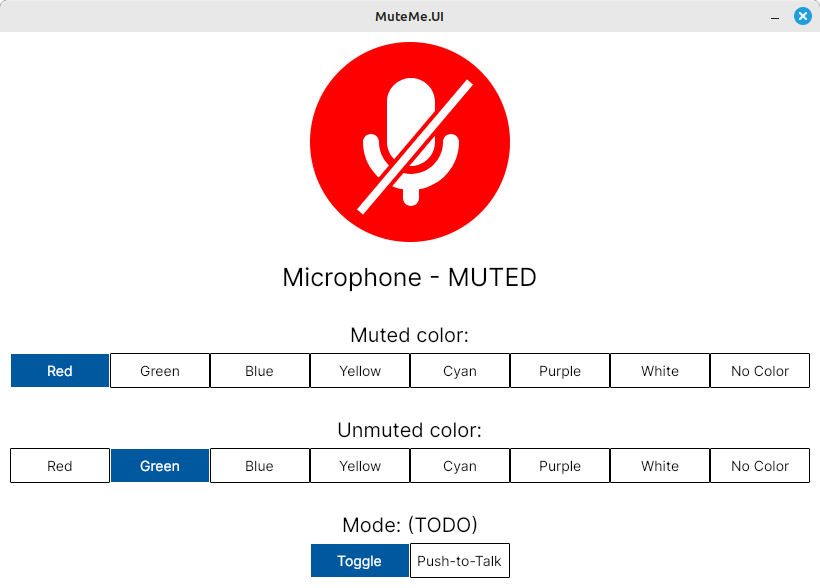

# MuteMe Button Client for Linux (LMDE) 

A UI project for the MuteMe button. I could not make it work properly on Linux Mint Debian Edition (LMDE), so I used on-line resouces from other projects to build a UI that mimics the behavior of the software that was originally created by MuteMe team.

It minimizes and closes to the system tray. The window can be brought to the focus from the system tray icon context menu. Tray icon is also used to close/exit the application. Double click on the tray icon brings the main windows as well.

Even though it is possible to make this fully multi platform utility, my primary goal was to make it work on LMDE. To make it fully multi-platform there are several changes that need to be done that will be specific to each OS.

## Yet TODO:

When using the button, I have not found use for push-to-talk functionality compared to the toggle. So for now I am leaving this functionality out.

## References

### Packages:

[HidSharp](https://github.com/IntergatedCircuits/HidSharp) used for reading and writing from/to USB

[Avalonia UI](https://github.com/AvaloniaUI/Avalonia) the UI framework for the application. In theory it should work on any OS with no or minor changes.

### Projects

the following projects were used to get ideas and code examples in the process:

[TouchPortalMuteMePlugin](https://github.com/L-C-P/TouchPortalMuteMePlugin)

[mutebtn](https://github.com/merll/mutebtn)

[muteme-diy](https://github.com/red-fox-star/muteme-diy)

### Project Icon

The microphone icon was take from the [svgrepo.com](https://www.svgrepo.com/svg/513446/microphone) website.

